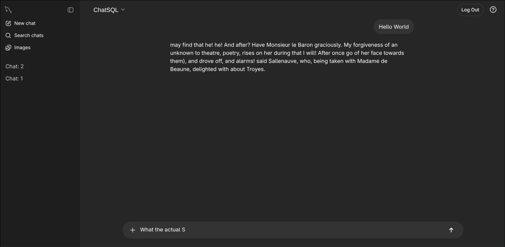

# ChatSQL
A terribly inefficient proof of concept chat-model based on an SQL database, mocking ChatGPT by "Open"AI.

Trained on some books from the [Gutenberg Dataset](https://arxiv.org/abs/1812.08092) which consists of books in public domain. This is why some of the dialogue generated is a bit older.

## How to run
1. Have make and Docker/Podman installed.
2. `make`
3. After the application has set itself up, access it at `localhost:5000`, and access the statistics page at `localhost:5000/stats`

## Higher quality sentences
[sentences.txt](sentences.txt) contains a set of around 108.000 sentences which the program uses to train its word prediction algorithm. Incase you want better results, replace it with the [backup-long-sentences.txt](backup-long-sentences.txt) which contains 2.280.000 sentences instead (but takes longer to train). Make sure to run `make clean` before to clear all previous data, otherwise the program wont re-train.

## Structure
[main.py](src/main.py) is the file containing all the Flask endpoints. 
[DBManager.py](src/DBManager.py) contains all SQL queries. 
[HashManager.py](src/HashManager.py) contains all functions related to salting and hashing data. 
[ChatManager.py](src/ChatManager.py) contains the functions to train the dataset, and handle user queries.
